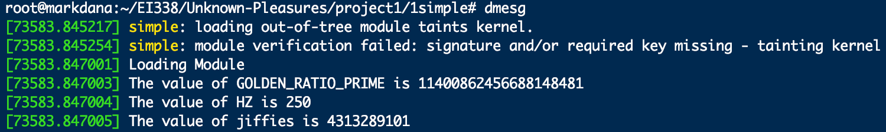
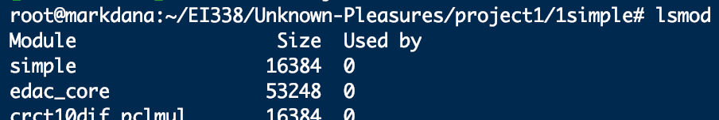
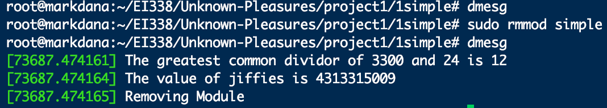
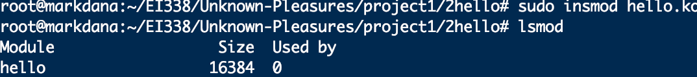
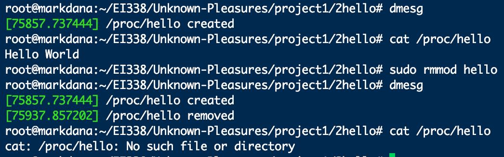
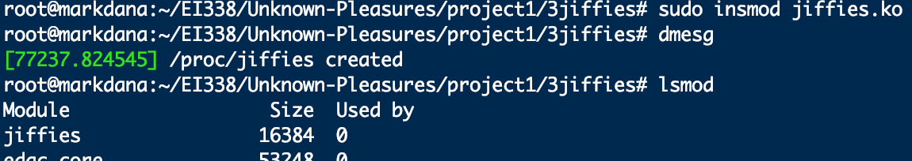
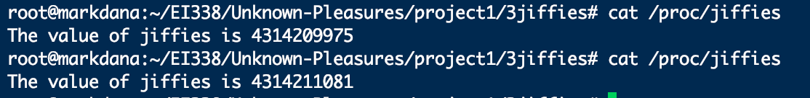
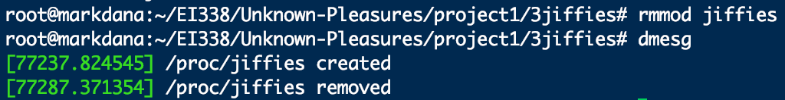
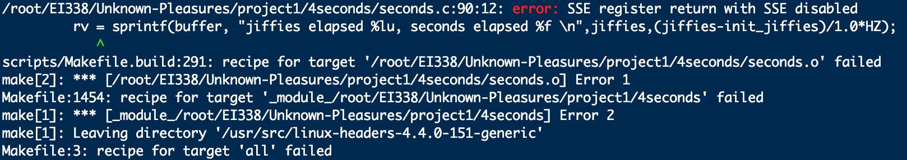
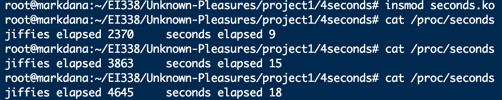

# EI338 Project 1
## 517030910288 戴昊悦

### 1. simple
#### Task
This section is corresponding to part Ⅰ and Ⅱ of the project on textbook. Basically the tasks are as follows,

+ Knowing how to compile `c` script to Linux kernel module.
+ Knowing some basic commands about Linux kernel.
+ Knowing how to load and remove kernel modules.
+ To get clear of the two important points, entry point and exit point, and knowing when the functions are invoked using `dmesg` command to check the contents of messages in the kernel log buffer.
+ Include some Linux kernel libraries. Specifically, print out the value of `GOLDEN RATIO PRIME` in the `simple init()` function, print out the greatest common divisor of 3,300 and 24 in the `simple exit()` function, print out the values of `jiffies` and `HZ` in the `simple init()` function, and print out the value of `jiffies` in the `simple exit()` function.

#### Solution
+ Pre packages

```c
#include <linux/init.h>
#include <linux/module.h>
#include <linux/kernel.h>
#include <linux/hash.h>
#include <linux/gcd.h>//unsigned long gcd(unsigned long a, unsigned b);
#include <asm/param.h>
#include <linux/jiffies.h>
```
+ Entry and exit points function

```c
/* This function is called when the module is loaded. */
static int simple_init(void)
{
       printk(KERN_INFO "Loading Module\n");
       printk(KERN_INFO "The value of GOLDEN_RATIO_PRIME is %lu\n",GOLDEN_RATIO_PRIME);
       printk(KERN_INFO "The value of HZ is %lu\n",HZ);
       printk(KERN_INFO "The value of jiffies is %lu\n",jiffies);
       return 0;
}

/* This function is called when the module is removed. */
static void simple_exit(void) {
	printk(KERN_INFO "The greatest common dividor of 3300 and 24 is %lu\n",gcd(3300,24));
	printk(KERN_INFO "The value of jiffies is %lu\n",jiffies);
	printk(KERN_INFO "Removing Module\n");
}
```

+ Declaration and invoking

```
/* Macros for registering module entry and exit points. */
module_init( simple_init );
module_exit( simple_exit );

MODULE_LICENSE("GPL");
MODULE_DESCRIPTION("Simple Module");
MODULE_AUTHOR("SGG");
```
Noticing that these macros are definded in Linux kernels.

#### Result

+ `simple_init`

<center></center>
<center></center>

+ `simple_exit`

<center></center>

+ analysis

Among the results, firstly I try to search something about `GOLDEN_RATIO_PRIME`. Exactly it's an unsigned long int defined in `<linux/hash.h>`, in order to reduce 'clash' and index as randomly as possible. As suggested by Knuth, the big number should be the prime number closest to the golden section ratio. For 64-bit system, it's 0x9e37fffffffc0001UL, exactly shown above. Or rather $$2^{63} + 2^{61} - 2^{57} + 2^{54} - 2^{51} - 2^{18} + 1$$closest to $$2^{64}\cdot\frac{\sqrt5-1}{2}$$

As for `jiffies` and `HZ`, `jiffies` records how many ticks it has take since the last reboot of the system, while the time one tick represents is defined in `CONFIG_HZ` of Linux kernel. Here `HZ` is 250 and `jiffies` until now is 4313289101. 4313289101/250 is around 199 days, however my Linux system has just runs for about one day. What causes this big slip? After seraching I know that the initial value of `jiffies` is not 0, but a value which will overflow after a specific time, in order to explose the problem as soon as possible. And this initial value varys among different systems.

-
### 2. hello
#### Task
This section is corresponding to part Ⅲ of the textbook, the `/proc` file system. The `/proc` file system is a “pseudo” file system that exists only in kernel memory and is used primarily for querying various kernel and per-process statistics.

What we are going to do is to design kernel modules that create additional entries in the `/proc` file system involving both kernel statistics and information related to specific processes.

#### Solution

The whole part of codes is the same as `hello.c` in source code. Here I try to comprehesive some functions and allocations of the system call.

+ `proc_read`

Invoked every time when `/proc/hello` is read. The function writes the string to kernel memory `buffer`.

+ `file_operations`

It's a struct and it initializes the instance `proc_ops` with two members `.owner` and `.read`. The value of `.read` is the name of the function `proc_read()` so as to be used in following process initialization. And I'm quite curious about `.owner=THIS_MODULE`, defined as `#define THIS_MODULE (&__this_module)`. Exactly when we use `insmod` to insert the kernel module, `insmod` calls the system call `init_module`, which calls `load_module` first and creates the kernel module by the files from user space, and finally returns a module struct. And within the kernel the module struct is used to represent the kernel.

+ `copy_to_user`

`proc_read()` writes the string to `buffer` in kernel memory, while `/proc/hello` can be accessed from user space, so we must copy the contents of `buffer` to `usr_buf` in user space using the kernel function `copy_to_user`.

#### Result

<center></center>
<center></center>

-
### 3. jiffies

#### Task

This section is assignment 1 of part Ⅳ. Design a kernel module that creates a `/proc` file named `/proc/jiffies` that reports the current value of `jiffies` when the `/proc/jiffies` file is read, such as with the command `cat /proc/jiffies`.

#### Solution

Only make some little modification to the `hello.c` and `Makefile`.

```c
rv = sprintf(buffer, "The value of jiffies is %lu\n",jiffies);
```

#### Result

<center></center>
<center></center>
<center></center>

-
### 4. seconds

#### Task

Design a kernel module that creates a `proc` file named `/proc/seconds` that reports the number of elapsed seconds since the kernel module was loaded. This will involve using the value of `jiffies` as well as the `HZ` rate. When a user enters the command
`cat /proc/seconds` your kernel module will report the number of seconds that have elapsed since the kernel module was first loaded. Be sure to remove `/proc/seconds` when the module is removed.

#### Solution

First we need to declare an unsigned long int `init_jiffies` ahead outside the function. And in `proc_init` we record the `jiffies` when the kernel module is loaded.

Then how to calculate the seconds ellapsed? Of course by `jiffies_ellapsed/HZ`. I'm expecting the floating point result, however I met with the error `SSE disabled` using either `float()` or `1.0*` to convert data type.

<center></center>

After searching I find that using floating point in Linux kernel is quite a tough thing. It's designed for saving the FPU registers and other FPU state takes time. Read calfully [SSE4](https://en.wikipedia.org/wiki/SSE4), [X86](https://en.wikipedia.org/wiki/X86), [MMX (instruction set)](https://en.wikipedia.org/wiki/MMX_%28instruction_set%29) and as illustrated in Robert Love's "Linux Kernel Development":

>No (Easy) Use of Floating Point

>When a user-space process uses floating-point instructions, the kernel manages the transition from integer to floating point mode. What the kernel has to do when using floating-point instructions varies by architecture, but the kernel normally catches a trap and then initiates the transition from integer to floating point mode.

>Unlike user-space, the kernel does not have the luxury of seamless support for floating point because it cannot easily trap itself. Using a floating point inside the kernel requires manually saving and restoring the floating point registers, among other possible chores. The short answer is: ***Don’t do it!*** Except in the rare cases, no floating-point operations are in the kernel.

Certainly I can use tricks like timing 1,000,000 then operating the division and mod, but that's not interesting. So finally I just use the approximate int instead.

#### Result

<center></center>